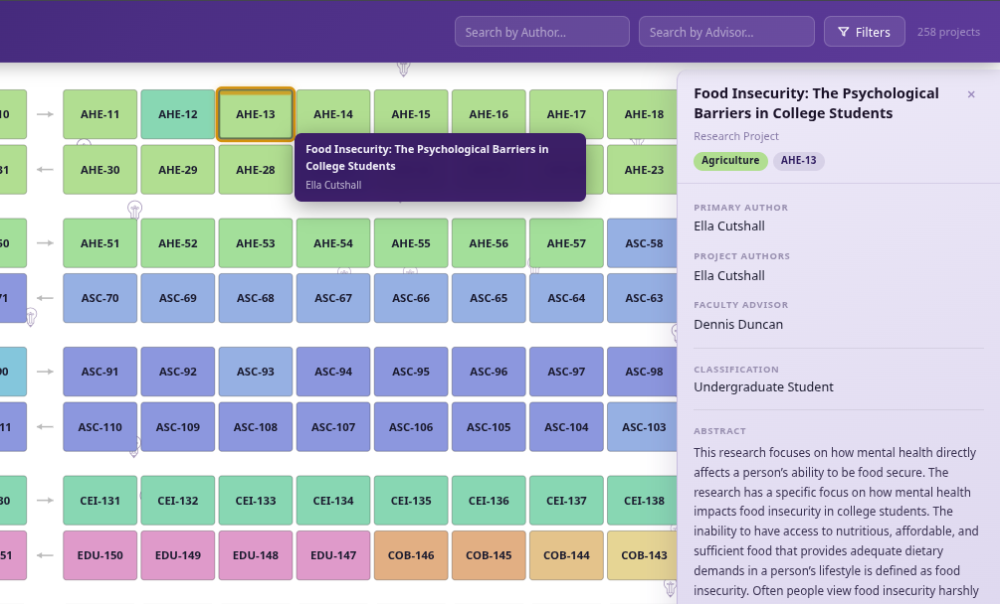
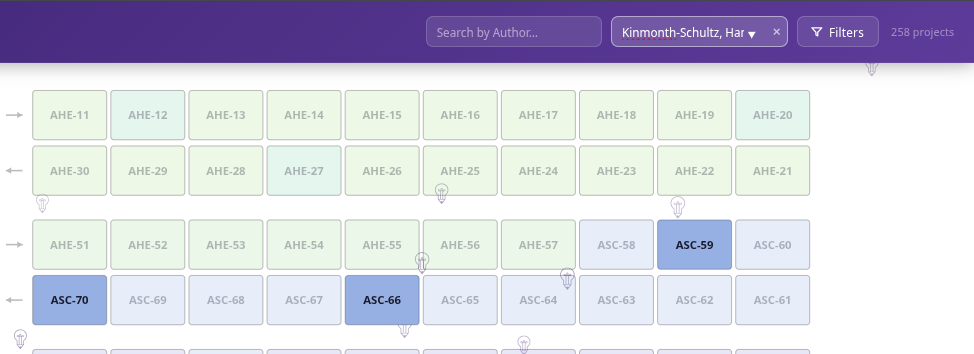
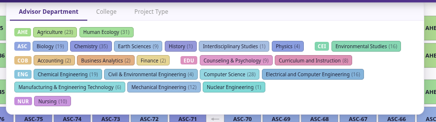
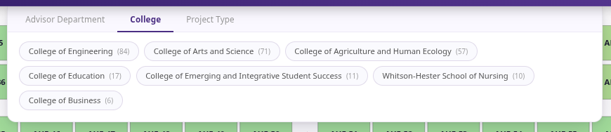
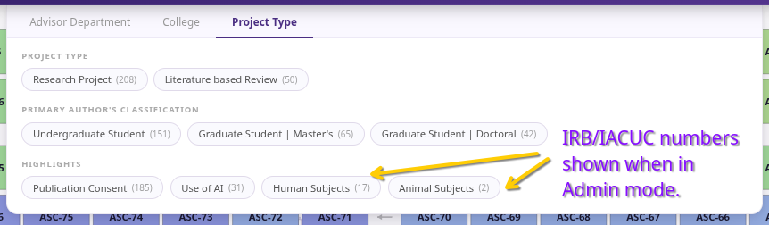

# RCIS '26 Table Map

An interactive table map for the 2026 Research and Creative Inquiry Symposium at Tennessee Tech. The tool lets students, faculty, and visitors locate projects, verify information, and helps advisors manage their caseload — no login required.

**[View the live map →](https://tn-tech-research.github.io/RCIS-26/)**

---

## Navigating the Table Map

The table map is the primary view of all symposium projects. Each colored block represents one submitted project. Blocks are arranged in a snaking layout — left-to-right on even rows, right-to-left on odd rows — with small directional arrows in the center gap indicating row direction.

### Table Numbers

Each block displays a table number ID in the format `PREFIX-N` (e.g. `AHE-13`, `ENG-42`). The prefix identifies the department group; numbers are assigned globally in alphabetical prefix order across all records.

### Color Coding

Block color indicates the primary author's department, grouped by college. The legend at the bottom of the map shows each department's color.

### Selecting a Project

Click any block to open the detail panel on the right side of the screen. The selected block is highlighted with a gold border and an animated top bar. The panel shows the project title, type, department, primary author, co-authors, faculty advisor, classification, and abstract. Click the same block again, or press ×, to close the panel.

### Hover Tooltip

Hovering over any block displays a floating tooltip with the project title and co-author list without opening the full detail panel.

---

## Author Search

Type any part of an author's name into the **Search by Author** field. Matching names appear as suggestions in a dropdown. Once a valid name is selected, all blocks whose author list does not include that person are dimmed. The search field shows a brighter border when a filter is active. Press × or clear the field to remove the filter.

## Advisor Search

Works identically to author search but filters by faculty advisor name. Both searches can be active at the same time, in which case only blocks matching both criteria remain fully opaque.

---

## Filters

Click the **Filters** button in the header to open the filter panel. An orange dot on the button indicates at least one filter is active. Use **Clear all** inside the panel to reset all filters at once. The panel has three tabs:

### Advisor Department

Displays color-coded department chips grouped under college header labels (AHE, ASC, ENG, etc.). Each chip shows the department name and project count. Selecting a chip dims all blocks not from that department. Only one department can be selected at a time; clicking the active chip clears the filter.

### College

Filter by submitting college using full college names (e.g. College of Engineering, College of Arts and Science). Only one college can be active at a time.

### Project Type

This tab contains three sub-sections:

- **Project Type** — filter by Research Project or Literature Based Review.
- **Primary Author's Classification** — filter by Undergraduate Student, Graduate Student | Master's, or Graduate Student | Doctoral.
- **Highlights** — four toggle filters: Publication Consent, Use of AI, Human Subjects (IRB), and Animal Subjects (IACUC). When a highlight toggle is on, non-matching blocks are dimmed rather than hidden. When Human Subjects or Animal Subjects is active, matching blocks display an **IRB** or **IACUC** label at the bottom of the block. When the Use of AI toggle is active, hovering a matching block also shows the project's AI use description in the tooltip.

---
